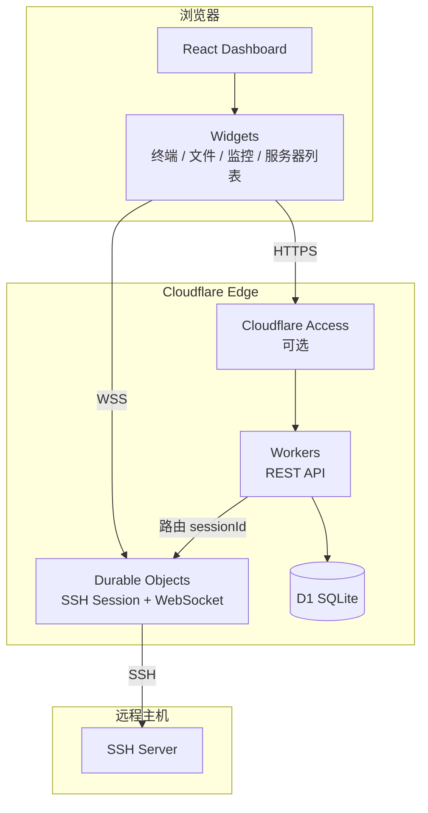
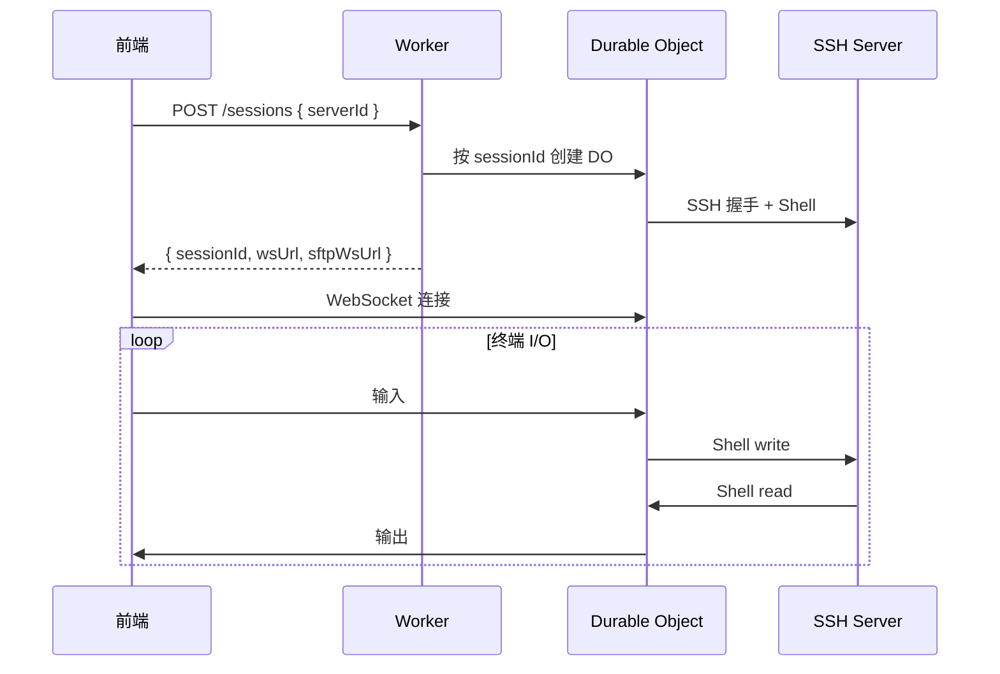

<p align="center">
  
</p>

<h1 align="center">ternssh</h1>

<p align="center">
  基于 Cloudflare 的多用户 SSH 工作台<br />
  可拖拽仪表盘 · 终端 · SFTP · 状态监控
</p>

<p align="center">
  <a href="LICENSE">GPL-3.0-or-later</a>
</p>

<p align="center">
  <a href="https://deploy.workers.cloudflare.com/?url=https://github.com/HaradaKashiwa/ternssh">
    
  </a>
</p>

<p align="center">
  
</p>

---

## 简介

**ternssh** 是一款运行在 Cloudflare Edge 上的 SSH 管理工具。用户通过可拖拽的仪表盘组件（服务器列表、终端、文件管理、状态监控等）构建属于自己的 SSH 工作台。

- **开放模式**：无需登录，适合个人本地或内网部署
- **Access 模式**：接入 Cloudflare Access，多用户数据隔离

## 功能特性

| 类别 | 能力 |
|------|------|
| **服务器管理** | 分组树形结构、拖拽排序、复制/编辑、密码与私钥认证 |
| **终端** | xterm.js + WebSocket；同一服务器多标签终端；命令联想与历史补全 |
| **文件管理** | SFTP 浏览、上传/下载、拖拽上传、目录操作 |
| **监控** | CPU / 内存 / 磁盘（Status）、网络带宽（Network）、进程列表（Process） |
| **快捷命令** | 预设与自定义命令，支持当前终端或全部会话 |
| **凭据库** | 已保存密码 / 私钥 vault（D1），添加服务器时可复用 |
| **仪表盘** | 网格拖拽布局，组件大小与位置持久化 |
| **个性化** | 浅色 / 深色 / 跟随系统、背景图、组件透明度、布局间距、终端配色 |
| **国际化** | 中文 / English |
| **站点设置** | 自定义站点名称（顶栏与浏览器标题） |
| **一键还原** | 还原本地偏好并重置数据库（服务器、凭据、布局等） |

## 技术栈

| 层级 | 技术 | 说明 |
|------|------|------|
| 前端 | React + Vite + Tailwind | 构建为静态资源，由 Workers 同域托管 |
| 后端 | Cloudflare Workers | REST API、路由、身份解析 |
| 实时连接 | Durable Objects | 每个 SSH 会话一个 DO 实例，WebSocket 长连接 |
| SSH 协议 | 自研 TypeScript 栈 | 握手、Shell、SFTP、远程命令执行 |
| 数据库 | Cloudflare D1 | 用户、服务器、布局、凭据、会话等 |
| 认证（可选） | Cloudflare Access | 边缘 JWT 校验，按 email 隔离用户 |
| DNS | Cloudflare 1.1.1.1 DoH | 域名主机名解析（IP 直连则跳过） |

## 快速开始

### 环境要求

- Node.js 20+
- [Wrangler CLI](https://developers.cloudflare.com/workers/wrangler/)

### 本地开发

```bash
git clone https://github.com/HaradaKashiwa/ternssh.git
cd ternssh
npm install

# 应用 D1 迁移（首次必须）
npm run db:migrate:local

# 方式 A：前后端分离（热更新）
npm run dev:server   # Workers + 静态资源，默认 http://localhost:8787
npm run dev:web      # Vite 开发服务器，代理 /api

# 方式 B：接近生产的集成预览
npm run build
npm run dev:server
```

### 部署

```bash
npm run deploy
# 等价于：构建前端 → 远程 D1 迁移 → wrangler deploy
```

| 组件 | 平台 |
|------|------|
| API + 前端 | Cloudflare Workers（`server/public/` 为 Vite 产物） |
| 数据库 | Cloudflare D1 |
| SSH 会话 | Durable Objects (`SshSession`) |
| 认证（可选） | Cloudflare Access |

**开放模式**：`ACCESS_ENABLED=false`，直接访问。

**Access 模式**：在 Zero Trust 创建 Self-hosted Application，配置 `ACCESS_ENABLED=true`、`ACCESS_TEAM_DOMAIN`、`ACCESS_AUD`。

### Docker 部署（自托管）

ternssh 基于 Cloudflare Workers 运行时。Docker 镜像通过 **Wrangler 本地模式** 启动完整应用（API + 前端 + 本地 D1 + Durable Objects），适合内网自托管或快速体验，**不等同于** Cloudflare 边缘生产部署。

官方镜像托管于 [GitHub Container Registry](https://github.com/HaradaKashiwa/ternssh/pkgs/container/ternssh)。推送 `v*` 标签（如 `v1.0.0`）时会自动构建并发布到 `ghcr.io/haradakashiwa/ternssh`。

#### 使用预构建镜像（推荐）

```bash
# 拉取最新版
docker pull ghcr.io/haradakashiwa/ternssh:latest

# 启动
docker run -d \
  --name ternssh \
  -p 8787:8787 \
  -v ternssh-data:/app/.wrangler \
  --restart unless-stopped \
  ghcr.io/haradakashiwa/ternssh:latest

# 访问
open http://localhost:8787
```

指定版本（去掉 `v` 前缀，例如 tag `v1.0.0` 对应镜像 `1.0.0`）：

```bash
docker run -d \
  --name ternssh \
  -p 8787:8787 \
  -v ternssh-data:/app/.wrangler \
  ghcr.io/haradakashiwa/ternssh:1.0.0
```

Docker Compose：

```bash
# 默认 latest
docker compose -f docker-compose.ghcr.yml up -d

# 指定版本
TERNSSH_TAG=1.0.0 docker compose -f docker-compose.ghcr.yml up -d

# 自定义端口
PORT=8080 docker compose -f docker-compose.ghcr.yml up -d
```

#### 从源码构建

```bash
# 构建并启动
docker compose up -d --build

# 访问
open http://localhost:8787
```

仅使用 Docker CLI：

```bash
docker build -t ternssh .
docker run -d \
  --name ternssh \
  -p 8787:8787 \
  -v ternssh-data:/app/.wrangler \
  ternssh
```

| 项 | 说明 |
|----|------|
| 镜像地址 | `ghcr.io/haradakashiwa/ternssh`（`:latest` / `:1.0.0` / `:1.0` / `:1`） |
| 默认端口 | `8787`（可通过环境变量 `PORT` 修改） |
| 数据持久化 | 挂载卷 `/app/.wrangler`（本地 D1 与 DO 状态） |
| 健康检查 | `GET /api/health` |
| 认证 | 容器内默认为开放模式；Access 需额外配置 Workers 环境变量 |
| 发布触发 | 推送 Git tag `v*` → [docker-publish.yml](.github/workflows/docker-publish.yml) 自动推送到 GHCR |

> 生产环境若需全球边缘、托管 D1 与 Access 集成，请使用 `npm run deploy` 部署到 Cloudflare。

## 项目结构

```
ternssh/
├── web/                    # 前端（React + Vite）
│   ├── public/logo.png     # 项目 Logo（favicon / 顶栏）
│   └── src/
│       ├── components/     # UI、设置、凭据字段
│       ├── dashboard/      # 网格布局、对话框
│       ├── widgets/        # 终端、文件、监控等小部件
│       ├── i18n/           # 中英文
│       ├── lib/            # API 客户端、会话、SFTP
│       └── theme/          # 主题与个性化
├── server/                 # Cloudflare Workers 后端
│   ├── src/
│   │   ├── routes/         # HTTP 路由
│   │   ├── do/             # Durable Objects（SSH 会话）
│   │   ├── db/             # D1 查询
│   │   ├── ssh/            # SSH / SFTP 协议实现
│   │   └── auth/           # Access JWT / 默认用户
│   └── migrations/         # D1 数据库迁移
└── wrangler.jsonc          # Workers / D1 / DO 配置
```

## 系统架构



### 认证模式

| 模式 | 条件 | 行为 |
|------|------|------|
| **开放模式** | `ACCESS_ENABLED=false` | 无需登录；数据归属内置用户 `default` |
| **Access 模式** | 已配置 Cloudflare Access | 边缘校验 JWT；按 email 自动创建用户并隔离数据 |

### 职责划分

**Workers（无状态）** — 身份解析、CRUD、创建会话并路由到 DO

**Durable Objects（有状态）** — 维护 SSH 连接、Shell 通道、SFTP、状态采集 WebSocket

**D1（持久化）** — 用户、服务器、分组、凭据、布局、会话记录、凭据 vault

## 仪表盘小部件

| 小部件 | 说明 |
|--------|------|
| `server_list` | 分组树、连接/断开、搜索、拖拽排序 |
| `terminal` | 多标签终端、命令联想（Tab / ↑↓） |
| `file_manager` | SFTP 文件浏览与传输 |
| `status` | CPU、内存、磁盘、运行时间 |
| `network` | 网卡流量与带宽曲线 |
| `process` | Top 进程（CPU / 内存） |
| `quick_commands` | 快捷命令（当前终端 / 全部会话） |

默认布局：服务器列表 + 终端 + 文件管理（三列）。

## API 概览

| 方法 | 路径 | 说明 |
|------|------|------|
| GET | `/api/v1/me` | 当前用户与认证模式 |
| POST | `/api/v1/me/reset` | 清空用户数据并重置布局 |
| GET/PUT | `/api/v1/dashboards` | 仪表盘与组件布局 |
| POST | `/api/v1/dashboards/reset` | 同 `/me/reset` 的数据库重置 |
| GET | `/api/v1/servers/tree` | 服务器分组树 |
| CRUD | `/api/v1/servers` | 服务器管理 |
| CRUD | `/api/v1/servers/groups` | 分组管理 |
| PUT | `/api/v1/servers/move` | 拖拽排序 |
| GET/POST/DELETE | `/api/v1/saved-passwords` | 已保存密码 vault |
| GET/POST/DELETE | `/api/v1/saved-private-keys` | 已保存私钥 vault |
| POST | `/api/v1/sessions` | 创建 SSH 会话 |
| WS | `/api/v1/sessions/:id/ws` | 终端 WebSocket |
| WS | `/api/v1/sessions/:id/sftp/ws` | SFTP WebSocket |
| GET | `/api/v1/sessions/:id/status` | 远程主机指标采集 |

### SSH 会话生命周期



## 数据库（D1）

迁移文件位于 `server/migrations/`：

| 迁移 | 内容 |
|------|------|
| `0001_init.sql` | users、servers、credentials、dashboards、widgets、sessions |
| `0002_server_groups.sql` | server_groups，servers 增加 group_id / sort_order |
| `0003_saved_passwords.sql` | saved_passwords 凭据 vault |
| `0004_saved_private_keys.sql` | saved_private_keys 凭据 vault |

```bash
npm run db:migrate:local   # 本地
npm run db:migrate         # 远程（deploy 已包含）
```

## 设置与个性化

在顶栏 **设置** 中可配置：

- **通用**：站点名称、语言、还原所有设置（双重确认）
- **个性化**：外观主题、背景图、组件透明度、布局间距、终端配色

还原所有设置会清除 localStorage 偏好，并调用 `POST /api/v1/me/reset` 清空该用户在 D1 中的服务器、凭据、会话与布局，恢复为初始状态。

## 安全说明

- **开放模式**无应用层认证，请勿在公网暴露敏感环境
- **Access 模式**下所有 D1 查询带 `user_id` 条件
- SSH 密码/私钥存于 D1 `credentials` 表（按服务器引用）；vault 条目存于 `saved_passwords` / `saved_private_keys`
- 全站 HTTPS / WSS；DO 实例按 session 隔离

## 配置参考

根目录 `wrangler.jsonc` 示例：

```jsonc
{
  "name": "ternssh",
  "main": "server/src/index.ts",
  "assets": {
    "directory": "./server/public",
    "not_found_handling": "single-page-application",
    "run_worker_first": ["/api/*"]
  },
  "d1_databases": [{
    "binding": "DB",
    "database_name": "ternssh",
    "database_id": "<your-database-id>",
    "migrations_dir": "server/migrations"
  }],
  "durable_objects": {
    "bindings": [{ "name": "SSH_SESSION", "class_name": "SshSession" }]
  },
  "migrations": [{ "tag": "v1", "new_sqlite_classes": ["SshSession"] }]
}
```

前端构建产物输出到 `server/public/`（`web/vite.config.ts` 的 `build.outDir`）。

## 开发路线

- [x] Workers + D1 脚手架，开放 / Access 双模式
- [x] 自研 SSH 协议栈、Durable Object 会话
- [x] 仪表盘拖拽布局与持久化
- [x] 终端、SFTP 文件管理、状态/网络/进程监控
- [x] 服务器分组、凭据 vault、多终端标签
- [x] 个性化、国际化、站点名称、一键还原
- [ ] 多仪表盘切换
- [ ] 插件化自定义小部件

## License

This project is licensed under the [GNU General Public License v3.0](LICENSE) (GPLv3).
